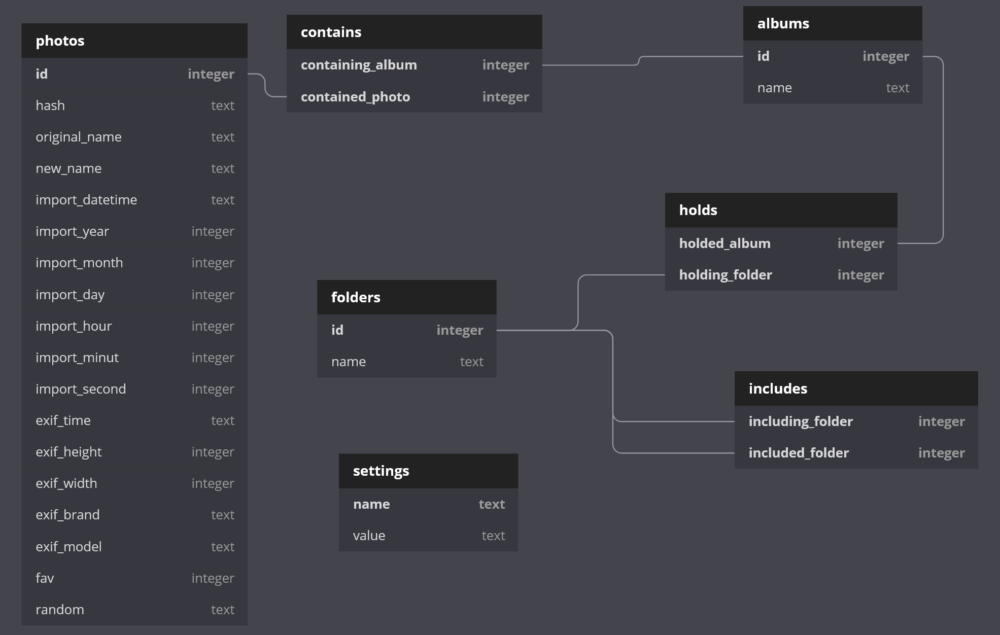

How to contribute to OSPL
------------------------------------------------------
First of all, thank you for your interest in contributing !  
Let's help make this photo library the best open source solution for managing your photos !

OSPL is a [GPL v2.0](LICENCE) licenced project and accepts contributions via GitHub pull requests.
This document outlines some of the conventions on development workflow, commit message formatting,
and other resources to make it easier to get your contribution accepted.

## Certificate of Origin

By contributing to this project you agree to the [Developer Certificate of
Origin (DCO)](DCO). This document was created by the Linux Kernel community and is a
simple statement that you, as a contributor, have the legal right to make the
contribution.

In order to show your agreement with the DCO you should include the following line at the end of commit message:
`Signed-off-by: John Doe <john.doe@example.com>`, using your real name.

This can be done easily using the [`-s`](https://github.com/git/git/blob/b2c150d3aa82f6583b9aadfecc5f8fa1c74aca09/Documentation/git-commit.txt#L154-L161) flag on the `git commit`.

## Main guidelines

* There is no need to hurry  
  We have prepared milestones that outline our goals, and we prefer for everyone to focus on the current milestone.
* Please follow the [NORM.md](NORM.md)
  We are following a code norm that you must follow in order for your contribution to be accepted.  
  Our norm is not very restrictive and aims to have a code that is coherent and legible to other contributors.
* Your commit messages should be clear and include all changes.  
  You should choose a clear title and then have a line for each change you made.
  Each line should be prefixed with the feature your change is affecting : `doc: `, `module: `, ...
* For build instructions see [README.md](README.md)
* We have documentation that explains most of the functions' behaviors. You can generate it using `cargo doc --no-deps --open`

## How to contribute
Pull requests (PRs) are the main and exclusive way to contribute to the official ospl project.
In order for a PR to be accepted it must pass a list of requirements:

* the PR title is clear and concice.
* ideally, each PR should bring one, and only one change to a single feature.
* the PR shoud have a description explaining what changes and why.
* all the tests (using cargo test) pass
* rust code is idiomatic, formatted according to [NORM.md](NORM.md) and without any warnings
* if the PR is a bug fix, it has to include a new unit test that fails before the patch is merged.
* if the PR is a new feature, it has to come with a suite of unit tests, that tests the new functionality.
* in any case, all the PRs have to pass the personal evaluation of at least one of the maintainers.

### Format of the commit message

The commit summary must start with a title and a semi colon, start with lower case letter
and with a verb in present tense. No dot in the end.

```
module: add a feature
tests: remove unused code
feature: fix a bug
```


## DB structure
Images are worth a thousand words so here is a diagram for the .db file.
You can also look [here](https://dbdiagram.io/d/5ec97ad039d18f5553ffa8cf) for a maintained version 
There is also a .sql file at the [root directory](database.sql)


## Milestones

You can look at the current milestones [here](https://github.com/AngeloFrangione/libospl/milestones)

## Big ideas
* For all awesome ideas look at [IDEAS.md](IDEAS.md) 

## External libraries

* To see our dependencies, look at the [Cargo.toml](Cargo.toml) file

